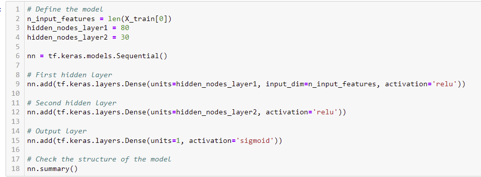
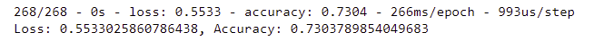
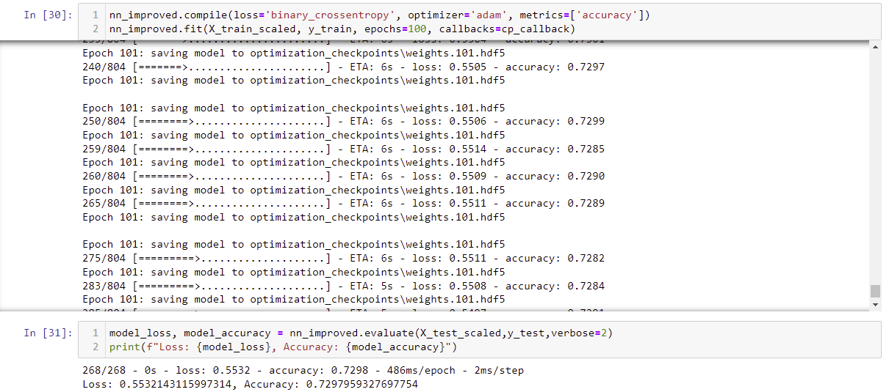
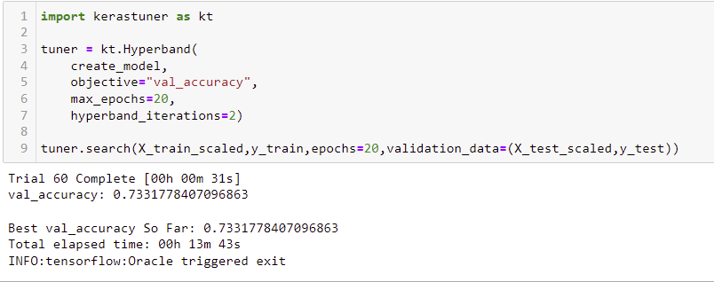

# neural_network
## Purpose
&emsp; The main purpose of this project is to train and optimize a neural network model to predict whether a funding applicant will be successful if funded by Alphabet Soup.

## Results
- "IS_SUCCESSFUL" is considered the target variable
- Everything else except for "SPECIAL_CONSIDERATIONS_N" is considered a feature
- "SPECIAL_CONSIDERATIONS_N" is neither a feature nor a target variable
- Initially, 80 neurons were chosen for the input layer and 30 for the second layer to go off of the general rule of thumb of having double the neurons there are input features 

 
- Was never able to reach target performance of 75%
- Several attempts have been made to try and increase performance which include
    - Increasing epochs
    - Deleting features
    - Changing activation function on each layer
    - Increasing layers and neurons
    - Using keras turner to optimize overall model structure

## Summary
&emsp; The model at its best has a 73% accuracy of predicting whether an applicant would succeed with a 52% loss. For a problem like this one, a logistic regression model just might be a better choice. The reason being that a logistic regression model is good at predicting the mathematical probability of something being in one group or the other.